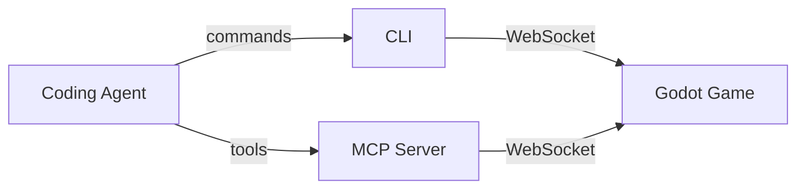

<h1 align="center">Godot Locator</h1>

<div align="center">
  

  Let coding agents test your Godot game UI via [Playwright](https://github.com/microsoft/playwright)-like API. 
</div>

<p align="center">
   <a href="https://sanitogonzalez.github.io/godot-locator/">Documentation</a> · <a href="FAQ.md">FAQ</a>
</p>

---

<p align="center">
  (Demo GIF placeholder)
</p>

> [!WARNING]
>
> This project is in early-devlopment stage, which can introduce breaking changes in the future.

## Why?

Unit/Integration tests cannot fully cover gameplays, leaving several approaches to test the gameplays:


| Approach | Pro | Con |
|----------|----------|---------|
| Human QA | Full gameplay coverage | Doesn't scale |
| Screenshots + [VLM](https://en.wikipedia.org/wiki/Vision-language_model) | Catch visual glitch | Image interpretation is not deterministic |
| **Text snapshot + [LLM](https://en.wikipedia.org/wiki/Large_language_model)** | Low inference cost/latency, Deterministic UI access | **No visual verification** (can be covered with [hybrid approach]()) |

**Godot Locator** powers the last approach — a Playwright-style API over the live UI tree that coding agents can drive directly.

### Key Features

- **Text representaion of Game UI**: [(SceneTree)](https://docs.godotengine.org/en/stable/classes/class_scenetree.html) is read as structured and LLM-friendly text.
- **Deterministic**: Interactions target UI nodes by name, type, or property — not screen coordinates that shift with every resolution or frame.
- **Extensible**: You can provide additional game contexts and customize text representaion of nodes in snapshots.

## Quick Start

Copy the following prompt and paste it to your coding agent:

```
Setup `Godot Locator CLI` referencing `https://github.com/SanitoGonzalez/godot-locator/tree/main/docs/how-to-setup-cli-for-agents.md`.
```

Then let them explore and interact with your Godot game:

```
Launch <path-to-godot-project> and click any button you see.
```

See the [documentation](https://sanitogonzalez.github.io/godot-locator/) for manual setup.

## How It Works

A small Godot plugin exposes the live SceneTree over WebSocket. Coding agents connect through the CLI or MCP server to query, interact, and take screenshots.



| Component | Role |
|-----------|------|
| **Godot Plugin** | Runs inside the game, serves the SceneTree over WebSocket |
| **CLI** | Command-line interface for agents that call shell tools |
| **MCP Server** | [Model Context Protocol](https://modelcontextprotocol.io) server for agents with native MCP support |

## Workflows

### Automated testing

Drive the game with an agent, assert on node state, and get a pass/fail result — no human in the loop.

```

```

### Automated testing with final screenshots

Run the full session via text snapshots for speed, then take a screenshot at key moments for visual verification.

```
```

### Infinite gameplay loop

Let an agent play indefinitely to surface edge cases, crashes, or unexpected states.

```
```

---

## [Documentation](https://sanitogonzalez.github.io/godot-locator/)

- [Godot Plugin setup](https://sanitogonzalez.github.io/godot-locator/plugin/)
- [CLI reference](https://sanitogonzalez.github.io/godot-locator/cli/)
- [MCP Server setup](https://sanitogonzalez.github.io/godot-locator/mcp/)
