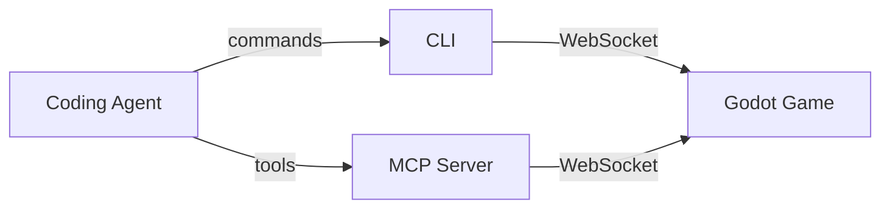

# Godot Locator

<div align="center">
  

**Let coding agents test your Godot game UI**

A [Playwright](https://github.com/microsoft/playwright)-inspired locator API for the live UI tree of Godot games.

</div>

<div align="center">

[](https://pypi.org/project/godot-locator-cli/)
[](https://pypi.org/project/godot-locator-mcp/)
[](https://github.com/SanitoGonzalez/godot-locator)
[](https://godotengine.org/)
[](https://www.python.org/)
[](https://github.com/astral-sh/uv)
[](LICENSE)

</div>

---

<!-- TODO: Add demo GIF/video here (30s clip of an agent navigating and clicking through a running game) -->

---
[main.tscn](tests/projects/simple-ui/main.tscn)
## Why Godot Locator?

Coding agents can write game code — but verifying it still requires a human to launch and play the game. Existing approaches don't fill that gap well.

| Approach | Coverage | Problem |
|----------|----------|---------|
| Human tests | Full gameplay | Slow, doesn't scale, inconsistent |
| Unit tests | Pure logic | No scene or gameplay coverage |
| Scripted tests | Limited gameplay | Breaks when the scene changes |
| Screenshots + [VLM](https://en.wikipedia.org/wiki/Vision-language_model) | Gameplay | Slower and more expensive |
| **Text snapshot + [LLM](https://en.wikipedia.org/wiki/Large_language_model)** | **Gameplay** | **No visual verification (use [screenshots](#workflow-automated-testing-with-final-screenshots) to compensate)** |

Godot Locator powers the last approach — a Playwright-style API over the live UI tree that coding agents can drive directly.

### Key Features

- **Token-efficient**: The SceneTree is read as structured text, not pixels. No images, no pixel processing — just the data that matters.
- **Deterministic**: Interactions target nodes by name, type, or property — not screen coordinates that shift with every resolution or frame.
- **Extensible**: Attach live game state (HP, score, current scene…) to every snapshot. Custom nodes can expose their own text and attributes.

## Quick Start

Copy the following prompt and paste it to your coding agent:

```
Setup `Godot Locator CLI` referencing `https://github.com/SanitoGonzalez/godot-locator/tree/main/docs/how-to-setup-cli-for-agents.md`.
```

Then let them explore and interact with your Godot game:

```
Launch <path-to-godot-project> and click any button you see.
```

See the [documentation](https://sanitogonzalez.github.io/godot-locator/) for manual setup.

## How It Works

A small Godot plugin exposes the live SceneTree over WebSocket. Coding agents connect through the CLI or MCP server to query, interact, and take screenshots — without any changes to your game code.



| Component | Role |
|-----------|------|
| **Godot Plugin** | Runs inside the game, serves the SceneTree over WebSocket |
| **CLI** | Command-line interface for agents that call shell tools |
| **MCP Server** | [Model Context Protocol](https://modelcontextprotocol.io) server for agents with native MCP support |

## Workflows

### Automated testing

Drive the game with an agent, assert on node state, and get a pass/fail result — no human in the loop.

```

```

### Automated testing with final screenshots

Run the full session via text snapshots for speed, then take a screenshot at key moments for visual verification.

```
```

### Infinite gameplay loop

Let an agent play indefinitely to surface edge cases, crashes, or unexpected states.

```
```

---

## [Documentation](https://sanitogonzalez.github.io/godot-locator/)

- [Godot Plugin setup](https://sanitogonzalez.github.io/godot-locator/plugin/)
- [CLI reference](https://sanitogonzalez.github.io/godot-locator/cli/)
- [MCP Server setup](https://sanitogonzalez.github.io/godot-locator/mcp/)
